# Scripture Insight MCP Server

**A modular Model Context Protocol (MCP) server that lets LLMs explore, analyze, and reason over the Bible—combining text retrieval, theology, language analysis, and historical context.**

Think of it as a developer-friendly “Bible intelligence layer” that an AI agent (like Claude) can call into natively.

---

## Architecture

- **Host / Client:** Claude Desktop (The application hosting the AI model and initiating the connection).
- **Server:** Python-based `FastMCP` server running locally on your machine (Exposes the tools to the Host).
- **Resources:**
  - **ChromaDB:** A local vector database (`chroma_db/`) holding semantic embeddings of scripture.
  - **Embeddings:** `all-MiniLM-L6-v2` via HuggingFace for fast, local semantic vectorization.

---

## The 10 MCP Tools

### 1. `search_verse`
**Purpose:** Find Bible verses by keyword or phrase.
* **Input:** `{ query: string, translation?: string }`
* **Output:** Matching verses with references.
* *Example:* "faith without works" → James 2:17

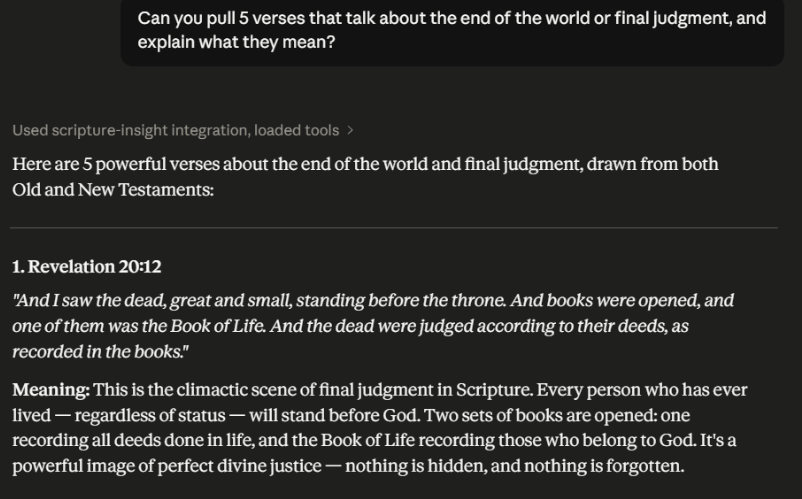

### 2. `get_verse`
**Purpose:** Retrieve a specific verse.
* **Input:** `{ book: string, chapter: number, verse: number }`
* **Output:** Exact verse text.

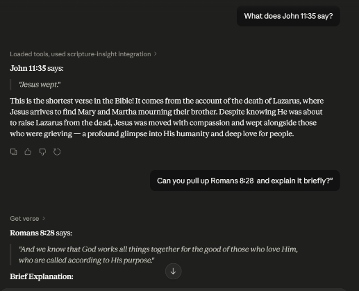

### 3. `get_passage`
**Purpose:** Retrieve a range of verses.
* **Input:** `{ book: string, chapter: number, startVerse: number, endVerse: number }`

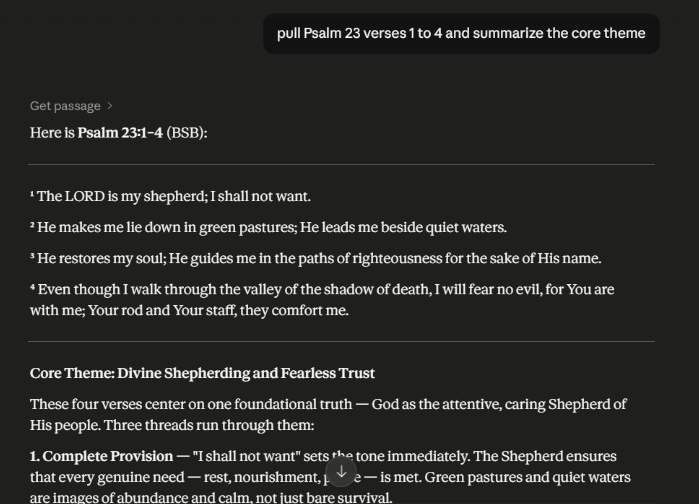

### 4. `cross_reference`
**Purpose:** Show related verses.
* **Input:** `{ reference: string }`
* **Output:** Linked verses (based on themes, citations, or study Bible data).
* *Example:* John 3:16 → Romans 5:8, 1 John 4:9

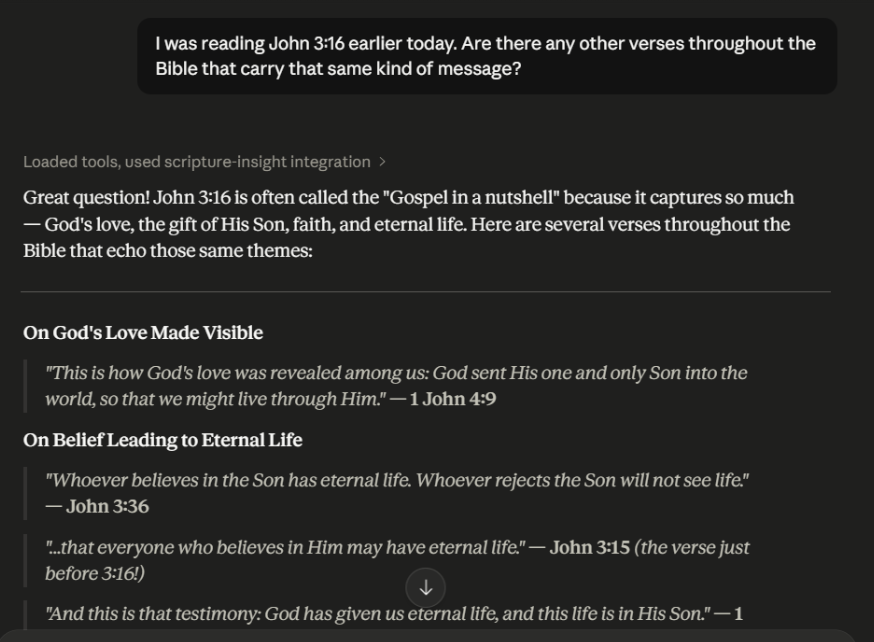

### 5. `topic_lookup`
**Purpose:** Find verses by theological topic.
* **Input:** `{ topic: string }`
* *Examples:* Grace, Salvation, Faith, Covenant

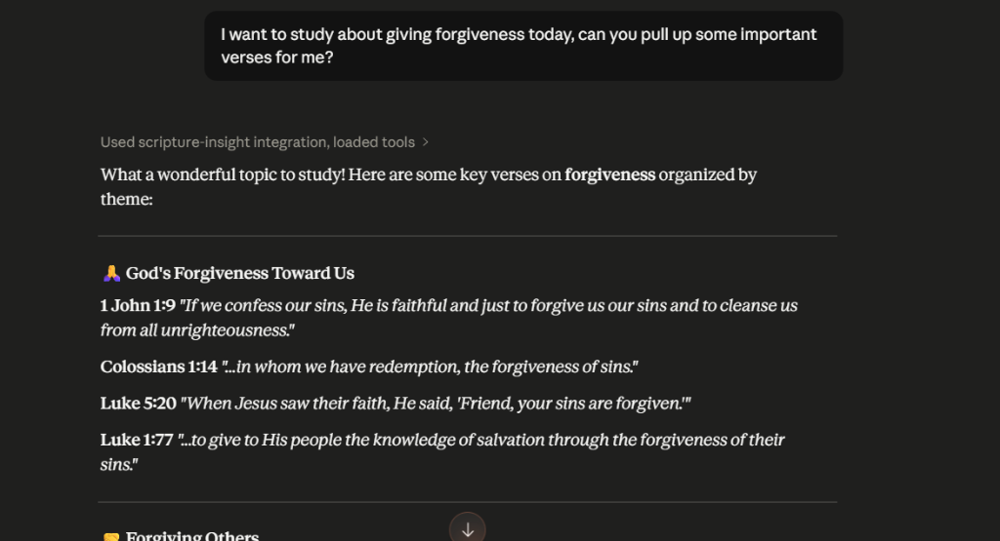

### 6. `original_language_lookup`
**Purpose:** Analyze Hebrew/Greek words.
* **Input:** `{ reference: string, word?: string }`
* **Output:** Original word, Transliteration, Meaning, Strong’s number.

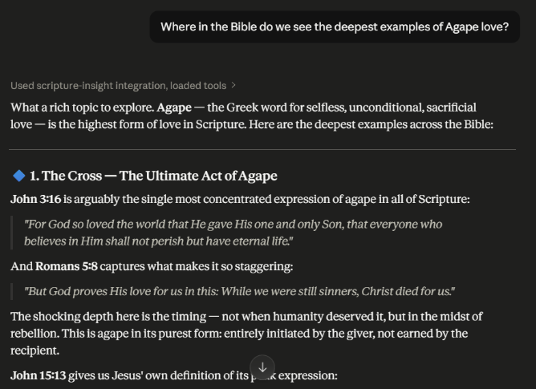

### 7. `character_profile`
**Purpose:** Get structured info about a biblical character.
* **Input:** `{ name: string }`
* **Output:** Key events, Associated verses, Relationships, Timeline summary.
* *Examples:* Moses, David, Paul

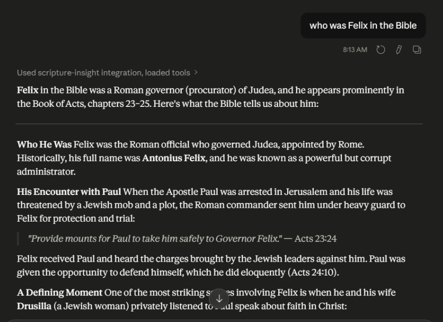

### 8. `timeline_event_lookup`
**Purpose:** Place events in the biblical timeline.
* **Input:** `{ event: string }`
* **Output:** Approximate date, Related scriptures, Historical context.

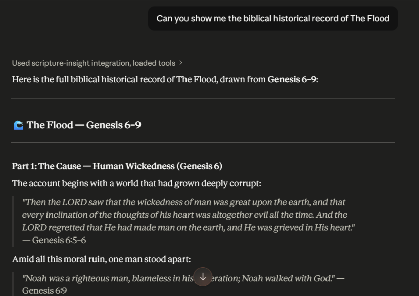

### 9. `summarize_passage`
**Purpose:** Summarize scripture with context.
* **Input:** `{ reference: string, style?: "short" | "detailed" | "devotional" }`

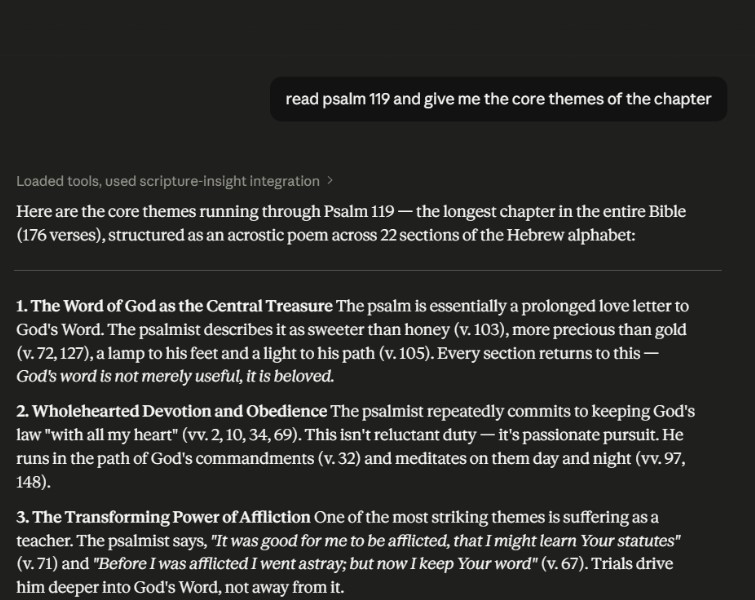

### 10. `theological_analysis`
**Purpose:** Deep reasoning tool (the “AI-heavy” feature).
* **Input:** `{ "reference": "string", "question": "string" }`
* **Output:** Interpretation, Doctrinal themes, Supporting verses, Multiple viewpoints (optional: denominational).

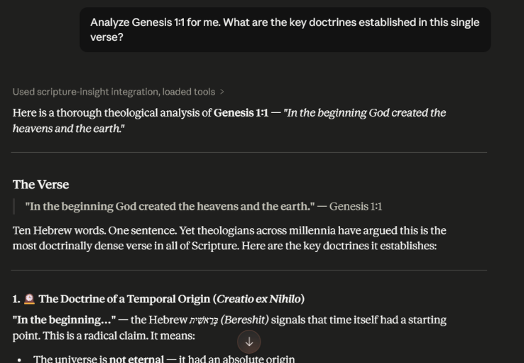
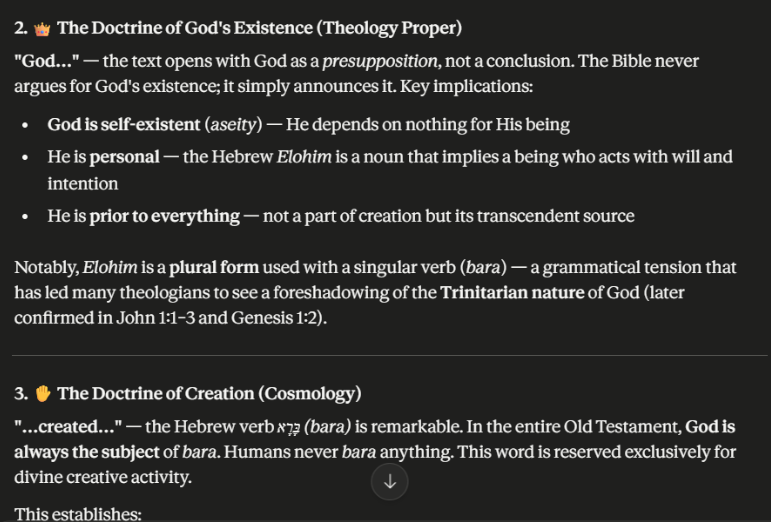


## Setup Instructions

### 1. Environment Setup
```bash
# Create and activate a virtual environment
python -m venv venv
venv\Scripts\activate

# Install dependencies
pip install -r requirements.txt
```

### 2. Database Ingestion
Before the server can search scripture, the database must be populated:
```bash
python scripture-mcp/database/ingest.py
```
This fetches the biblical text, generates semantic embeddings, and stores them in the persistent `chroma_db/` directory.

### 3. Claude Desktop Configuration
To connect Claude Desktop to your local MCP server, update your `claude_desktop_config.json` (located in `%APPDATA%\Claude\claude_desktop_config.json` or the local packages folder for the MS Store version):

```json
{
  "mcpServers": {
    "scripture-insight": {
      "command": "C:\\Absolute\\Path\\To\\venv\\Scripts\\python.exe",
      "args": [
        "C:\\Absolute\\Path\\To\\scripture-mcp\\server.py"
      ]
    }
  }
}
```
*Note: Always use absolute paths for the command and args to ensure the sandbox resolves correctly.*

---

## Folder Structure

```
Scripture Insight MCP Server/
├── assets/                  # Screenshots demonstrating the tools
├── requirements.txt         # Python dependencies
├── scripture-mcp/
│   ├── database/
│   │   ├── chroma_db/       # Persistent local vector database storage
│   │   ├── chroma_client.py # Database connection singleton
│   │   └── ingest.py        # Script to populate the database
│   ├── services/
│   │   ├── bible_api.py     # Handles fetching external Bible data
│   │   ├── embeddings.py    # HuggingFace sentence-transformers logic
│   │   └── search_service.py# Core semantic search logic
│   ├── tools/               # The 10 modular MCP tools (detailed below)
│   └── server.py            # FastMCP server entrypoint & tool registration
```
*All functions and modules are documented using standard Python docstrings for clarity and maintainability.*

---